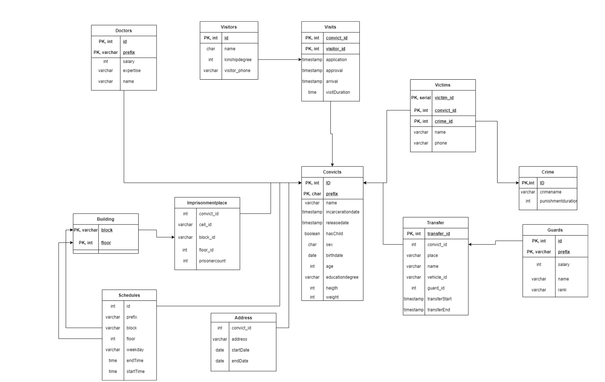

# Sample Prison Database

## Group Members
```
Ufuk Özkul 
Seden Dora Açık 
Tolgay Atınç Uzun 
```


## Entity 1
Convicts: will be identified by their ID number. ID will be their primary key. 
Their profilic data will be extracted by their id, names, incarceration date, release date, 
haschild, sex, age, birthdate, height and width. Moreover, the educational level is going 
to be held to ease the selecting the candidates for in-prison duties. For instance, if the 
convict was a chef before, in prison duties might be offered. Lastly, from the table, it 
could  be  seen  that  there  are  two  derived  attributes,  namely,  age  and  release  date. 
These might be removed on upcoming versions as they can be calculated directly. 
## Entity 2
Guards: will be identified by their ID number. ID will be the primary key. They 
will have the attributes as following: title, name, address, unit, salary, rank, phone. 
## Entity 3
Doctors:  will  be  identified  by  their  ID  number.  Similar  to  guards,  pretty 
standard attributes will be created as ID, name, salary, expertise, phone. 
## Entity  4
Building:  will  be  identified  by  their  ID  number.  As  there  are  numerous 
buildings  for  special  purposes  their  design  will  differ.  Therefore,  they  should  have 
different amount of floor levels. Because of that, floor attribute which denote the floors 
is added. This way it is possible to get maximum amount of floor by count() function as 
well as access to the floor levels. 
## Entity 5
Imprisonment Place: Each cell is found inside of a floor level in block. Cells 
will  be  defined  by  their  codes.  As  only  convicts  can  stay  in  the  cells,  convicts  and 
imprisonment  place  will  have  a  relation.  Also,  it  is  known  that  there  are  cells  inside 
some buildings but not all so building have a relation with imprisonment place. 
## Entity 6
Visitors: Visitors will have a separate table and it will be closely related to 
the  prisoners.  It  is  possible  to  assume  they  will  be  weak  entities  because  their 
existence depends on the convict. If a visitor is added to the table, the visitorID will be 
related with the convict ID. visitorID is a primary key while others are just attributes, 
name and phone. Additionally, official application date for the visit will be recorded in 
another  relation, connecting convicts and visitors, called “visits”. If the permission is 
given, then the date and hour of arrival is going to be given to the relative in “visits” 
table. 
## Entity  7
Schedules:  Schedules  of  the  guards,  health  workers  and  convicts  will  be 
stored  in  this  table.  The  ID  of  every  person  will  be  pulled  from  their  own  table. 
Interestingly this introduces a problem. If the people with same ID but different group 
is to be inserted into the schedule table loss of information would occur. To solve this 
issue, every convict, guard and health worker will have a group prefix. For example, 
convicts IDs are going to be started by ‘c’ like ‘c1, c2, c3...’. Also, it will be storing 
datetime variables, duty hours, days. 
##Entity  8
Transfer:  This  table  will  keep  information  about  the  transfer  data  of  the 
convicts. Where, when, how, they transferred and who escort them. So, attributes will 
be date, vehicle code, escort ID, and transfer ID which is primary key. 
## Entity 9
Victim: Victim table will be defined with two primary keys; Convicts ID and 
Crime ID. That means we can reach the convicts’ crime(s) and in case of more than 
one crime occurrence, with the Crime ID we can specify the desired result. 
## Entity  10
Crime:  Crime  table  stores  all  crimes  committed  by  the  criminals.  The 
primary key will be the Crime ID and foreign key will be the convicts’ ID. As attributes, 
place of the crime, date and time, and name will be stored. 


# Java Explanation 
This java application handles insert, update, delete and print for the database.  
## Insert
When the user enters 1 as input, insert function is executed. This has only been done 
for  one  table  called  convicts.  The  premade  columns  made  it  easier  to  enter  values  without 
getting dynamic number of columns and their types. The user prompted to enter the attribute 
values corresponding to convicts table. It starts by name and goes until weight. 
## Update
When 2 is entered as input, update function will execute. First of all, the user must 
enter  the  table  name  in  order  to  do  the  operations.  Then,  the  columns  of  that  table  are 
displayed to make it easier to choose what to change. After the table name, the conditions 
should  be  specified  to  not  to  change  whole  entries.  This  condition  part  is  a  basic  SQL 
compatible predicate. It will bring a table that the update operation will take place on. Following 
the next input, the user must enter column names with one comma and one white space for 
separation. This indicates which columns will be set from the table that has been brought by 
predicate. Lastly, the user should enter the corresponding values for these columns. 
## Delete
Third option is the delete function for database. It deletes multiple rows in which the 
where clause is met. This operation accepts only one predicate denoted by where clause so 
it  is  more  primitive  when  compared  with  update  function  but  it  is  secure  enough  that  user 
cannot delete every row. It starts by asking one column name and continues to ask a value 
for that column. Then, it deletes every row which is true for the predicate. The user must be 
careful and should use ID as main delete column. Otherwise, multiple entries will be deleted.  
## Print
This method works when user selects fourth option in menu. It asks for a table name to 
be printed and same as before, gives the column names to user. The user can decide to print 
all  of  the  table  but  also  can  select  specific  attributes,  too.  After  that,  a  predicate  should  be 
entered. It prints all the columns according to the order which match with the predicate. 




